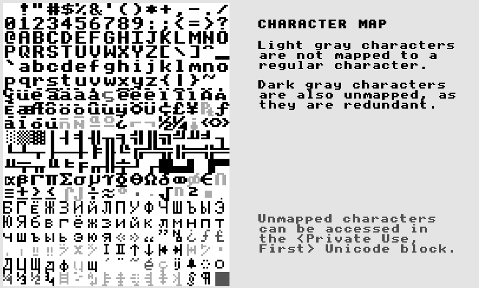

# TempleOS font

These are the converted TempleOS fonts. If you're unsure which file to install,
use the `.ttf`.

Made with [Bits n' Picas](https://github.com/kreativekorp/bitsnpicas) and lots
of work! Some work is needed, the 'r' is slightly misaligned, for example. Only
the `.ttf` has been tested.

All characters are mapped, see chart:

